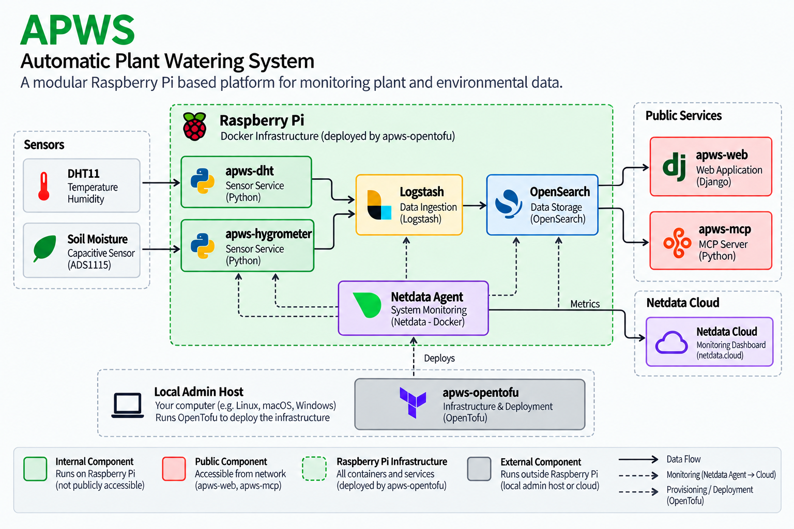

# APWS project
**A**utomatic **P**lant **W**atering **S**ystem

---

## Overview

APWS combines sensors, data processing, storage and a web interface into one modular system.

The project consists of five repositories:

| Repository                                                      | Purpose                       |
| ----------------------------------------------------------------| ----------------------------- |
| [apws-web](https://github.com/ronnyfriedland/apws-web)          | Django web application        |
| [apws-dht](https://github.com/kerstinli/apws-dht)               | Temperature & humidity sensor |
| [apws-hygrometer](https://github.com/kerstinli/apws-hygrometer) | Soil moisture sensor          |
| [apws-mcp](https://github.com/ronnyfriedland/apws-mcp)          | MCP interface for sensor data |
| [apws-opentofu](https://github.com/kerstinli/apws-opentofu)     | Infrastructure & deployment   |

The system is designed to run on a Raspberry Pi and uses Docker-based services wherever possible.

## Contributors

- https://github.com/kerstinli
- https://github.com/ronnyfriedland

## Architecture



## Data Flow

```text
Sensors
   │
   ▼
Sensor Services
   │
   ▼
Logstash
   │
   ▼
OpenSearch
   │
   ├──► apws-web ──► Browser
   │
   └──► apws-mcp ──► AI Client
```

## Technology

* **Raspberry Pi** — hardware platform
* **Docker** — service runtime
* **Python** — sensor services and MCP
* **Django** — web application
* **Logstash** — data ingestion
* **OpenSearch** — data storage
* **OpenTofu** — infrastructure
* **MCP** — AI integration

## Repository Structure

```text
APWS
├── apws-web
├── apws-dht
├── apws-hygrometer
├── apws-mcp
└── apws-opentofu
```
